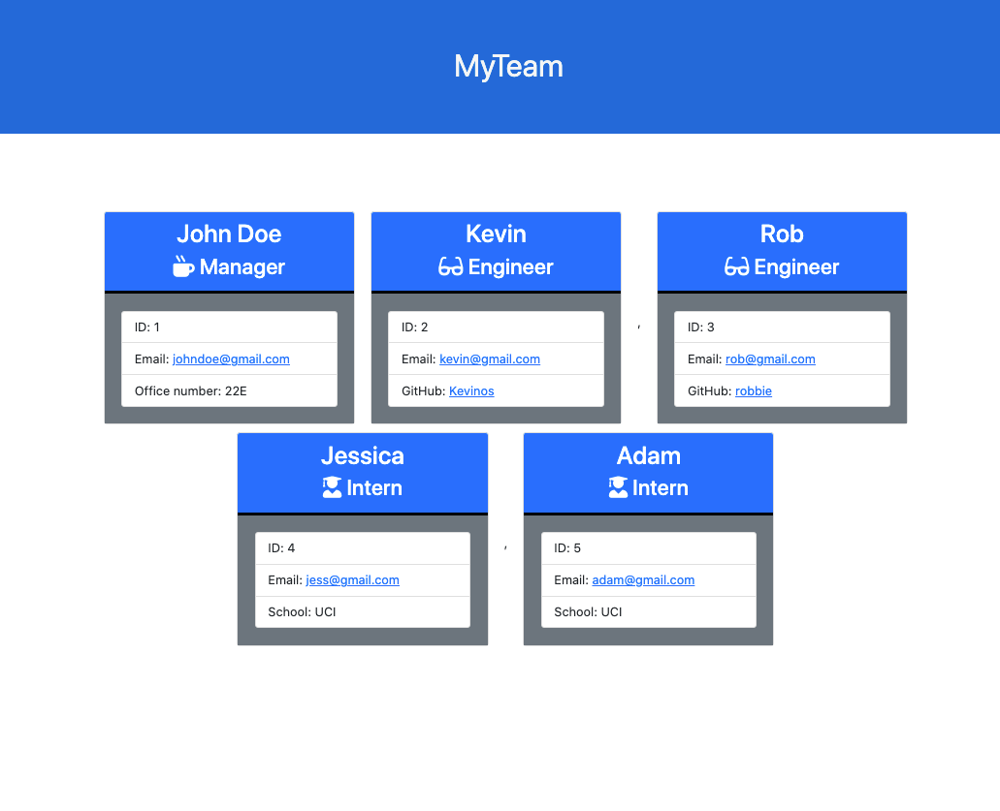

# teamGenerator
  

## Description

🔍 Software engineering team generator command line application. You will be prompted for information about the team [Manager, Engineer, Intern] to create a HTML page that renders all team cards created. Team manager will have quick and easy access to engineers Git Hub pages.

 

    